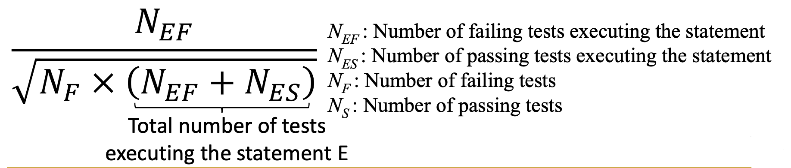

# Assignment 2 Frequently Asked Questions (FAQs)

If you have more questions on the assignment, please contact the TA

## Q0. Missing artifact org.evosuite:evosuite:jar:1.2.0

Currently, the newest evosuite (i.e., 1.2.0) has not been updated to Maven: https://repo.maven.apache.org/maven2/, therefore, you may encounter the `missing artifact org.evosuite` error when you are compiling your project using Maven. To solve this issue, you need to add the local jar into your maven project following [this](https://stackoverflow.com/questions/4491199/build-maven-project-with-propriatery-libraries-included/4491343#4491343) link. You can directly run the [script](scripts/install_latest_evosuite.sh) to install your local evosuite to your maven project. 
You can directly use the command `java -jar lib/evosuite-1.2.0.jar (+configuration parameters)` to generate tests with Evosuite without relying on Maven.

## Q1. I cannot run test cases generated by Evosuite in Eclipse, and/or, EclEmma fails to report coverage for the test cases generated by Evosuite

1. Remember to add `evosuite-1.2.0.jar` to your class path

2. Comment out the annotation before the test case class declaration (XXX_ESTest):
```java=
@RunWith(EvoRunner.class) @EvoRunnerParameters(mockJVMNonDeterminism = true, useVFS = true, useVNET = true, resetStaticState = true, separateClassLoader = true, useJEE = true)
```
3. Remove the `extends *_ESTest_scaffolding`

## Q2. In the fault localization, how can we run each Junit test separately and get the execution results (pass/fail)?
There are multiple ways. 
Our suggestion is use the API `org.junit.runner.notification.RunListener`,  whose reference 
is [here](https://junit.org/junit4/javadoc/4.12/org/junit/runner/notification/RunListener.html).

Following is an example. Feel free to modify it to meet your requirements after you fully understand the reference.  


```java
import org.junit.runner.Description;
import org.junit.runner.JUnitCore;
import org.junit.runner.Result;
import org.junit.runner.notification.Failure;
import org.junit.runner.notification.RunListener;

public class JUnitTestRunner {
	public static void main(String... args) throws ClassNotFoundException {
		JUnitCore junit = new JUnitCore();
		junit.addListener(new RunListener() {
			public void testAssumptionFailure(Failure failure) {
			}

			public void testFailure(Failure failure) {
			}

			public void testFinished(Description description) {
			}

			public void testIgnored(Description description) {
			}

			public void testRunFinished(Result result) {
			}

			public void testRunStarted(Description description) {
			}

			public void testStarted(Description description) {
			}

		});
		// make sure the class file can be found in classpath. 
        Result result0 = junit.run(TestSuite.class);
        
	}
}
```

## Q3. What is the ranking of a statement if its suspicicous score is the same as that of many other statements?

In Task 2 and 3, we require you to use `Ochiai` ranking function as mentioned in the lecture slides: 


`Ochiai` computes suspicious score for each statement. It is possible that multiple statements receive the same score. 
To break this tie, we require you to compute the ranking for each statement based on the suspicious score, [as mentioned in Task 2](./assignment2.md#ranking-of-suspicious-statements). 

## Q4. Am I allowed to include many faulty functions in the same test case to increase the suspicious score of faulty statement?
In Task 3, you are asked to extend the existing test suite to achieve the higher ranking of suspicious statements. Some students may write some test cases that include multiple faulty functions as follows:
```
String string0 = foo();    # Execute faulty statement 1
String string1 = foo2();    # Execute faulty statement 2
String string2 = foo3();    # Execute faulty statement 3
assertEquals(“some_text”, string2)    # Fail
```
However, such test case is not allowed. Each statement in the test sequences should be written so that it contributes to an assertion. In other words, the assertion will no longer work if any of statement in the test sequence is removed. Under this criterion, the first two statements in this example is redundant and should be removed.
In contrast below test case is allowed:
```
String string0 = foo();          # Execute faulty statement 1
String string1 = foo2(string0);    # Execute faulty statement 2
String string2 = foo3(string1);    # Execute faulty statement 3
assertEquals(“some_text”, string2)    # Fail
```
All statements in this example are relevant, removal of any will cause the assertion no longer to work.

## Q5. Should I include the target statement when ranking? Should I ground or floor the result?
In Task 2, you are asked to rank the statement following: $\frac{N+M+1}{2}$. When ranking the statement $a$, you should also consider $a$ when measuring the ranking. The ranking result will be further floored to integer. For example, if a sequence of suspicious scores is (0.9, 0.8, 0.8, 0.8, 0.8, 0.7), the ranking of each statement is calculated as follows:
```
rank(stmt 1): floor((0+1+1)/2)=floor(1)=1
rank(stmt 2/3/4/5): floor((1+5+1)/2)=floor(3.5)=3
rank(stmt 6): floor((5+6+1)/2)=floor(6)=6
```
